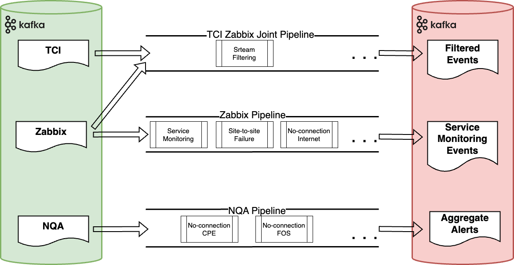
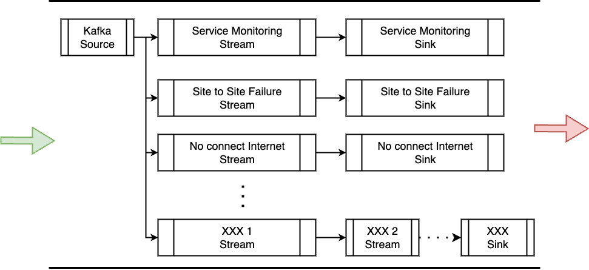
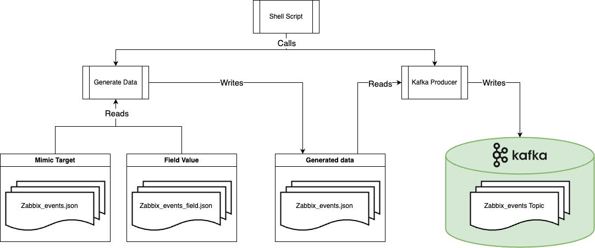

# Correlation-CEP
A project containing the re-imagined version of the [Correlation Engine project](https://git.swisscom.com/projects/EC-ASR/repos/correlation-engine/browse).\ 
Contains of a data correlation engine and a data generation engine(for testing purpose).

## Correlation Engine
### Overall Architecture
This project `./correlation` has a legacy KSQL implemenation and a Flink implemenation.\
Current flink implementaiton is based on legacy KSQL implementation, it consumes data from 3 kafka event topics `Zabbix_events`, `TCI`, `nqa_raw` and produce into 3 kafka alert topics `FILTERED_EVENT_TOPIC`, `SERVICE_MONITORING_TOPIC`, `AGGREGATION_ALERTS_TOPIC`.\
Data path is abstrated as a pipeline (implemented using data stream), and each data correlation business logic is abstracted as a service to be used inside related pipeline (implmented using data stream), has an overall architecture:

  

### Inside Pipeline
Example shows the detail of `Zabbix` pipeline, which contains correlation logic with `Zabbix_events` data, Service Monitoring, Site-to-Site Failure Aggregation, No-Connection Internet Aggregation.\
A process pipeline starts with a kafka source and follows by multiple chains of data stream and kafka sink.\
 Where each data stream is concrete data stream processing logic, contains features like processor function, trigger, state processing and window processing.\
Kafka source and kafka sinks are configured with corresponding concrete topic following business logic.\
In this case, kafka source is configured to consume from topic `Zabbix_events`, Service Monitoring Sink is configured to produce to topic `SERVICE_MONITORING_TOPIC`.\
While Site-to-Site Failure Sink and No-Connection Internet Sink both produce to `AGGREGATION_ALERTS_TOPIC`.

  

### Why Flink
State Processing and Event Trigger: Flexiablity implementing logic
Processing time and Event time: Wall time and data time

## Generating Engine
This project `./datagen` is for producing event data for tesing purpose, consists of a data generation engine and a Kafka producer instance:\

