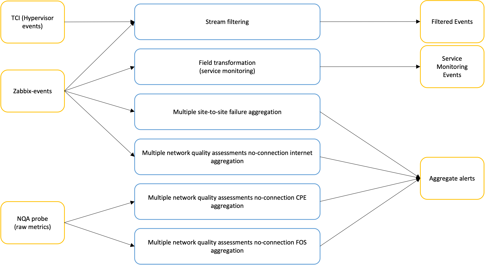

# Correlation-CEP
A project containing the re-imagined version of the [Correlation Engine project](https://git.swisscom.com/projects/EC-ASR/repos/correlation-engine/browse).
The existing transforms look as follows:


## Part 1: Generating Data
There are 3 input sources, each of which contains JSON messages. Within these sources, many of the fields are irrelevant to the correlation/aggregation function itself.
As such, when generated, they may be left with a default or populated with dummy data.

The following subsections will detail each source topic, and the important fields, as well as the possible ranges for said fields
note that the `%` is a wildcard in the strings below, and is not a literal %

---

### Zabbix-events
```json
{
  "event_url": "exampleURL",
  "zabbix_environment": "site-aaa",
  "zabbix_site": "bbb",
  "zabbix_action": "close",
  "host_in_maintenance": false,
  "host_name": "41FW0",
  "host_ip": "123.123.128.234",
  "trigger_id": 86472,
  "trigger_name": " is Unavailable by ICMPping",
  "trigger_description": "",
  "event_id": 30210041,
  "event_tags": {
    "TRIGGER": "NodeDown",
    "VNF-Type": "vesbc"
  },
  "event_datetime": "2023-02-19T08:14:44Z",
  "event_nseverity": 5,
  "event_update_datetime": "",
  "event_update_message": "",
  "event_update_action": "",
  "event_recovery_datetime": "2023-02-19T09:09:44Z",
  "action_datetime": "2023-02-19T09:09:44Z"
}
```

relevant fields:
* `zabbix-action`: `create` or `close`
* `trigger_name`: `%Unavailable by ICMPping%`, `Unavailable by ZabbixProxyPortCheck`, `Internet NQA Target not reachable from%`
* `event_tags` : is a map, here are some k:v pairs that should be used: `TRIGGER:NodeDown`, `VNF-Type:hevpe`, `VNF-Type:vfw-mgmt`
* `action_datetime`: date formatted by **'yyyy-MM-dd''T''HH:mm:ssX'**

---

### TCI (Telco Cloud Infrastructure
```json
{
  "zabbix_environment": "PRD",
  "event_url": "https://zabixurl",
  "zabbix_action": "create",
  "zabbix_site": "OLT",
  "host_in_maintenance": false,
  "trigger_id": 166222,
  "trigger_name": "Zabbix agent on CEEOLT131 compute-52-2 is unreachable for 3 minutes",
  "trigger_description": "Help in knowledge database at:",
  "event_nseverity": 4,
  "event_id": 14946800,
  "event_update_message": "",
  "event_update_action": "",
  "event_tags": [
    {
      "tag": "Autobots",
      "value": "TCIOPS-3846"
    },
    {
      "tag": "Team",
      "value": "Pace"
    },
    {
      "tag": "Trigger_ID",
      "value": "166222"
    }
  ],
  "event_datetime": "2023-03-10T19:27:22Z",
  "event_update_datetime": "",
  "event_recovery_datetime": "",
  "host_name": "compute-52-2.ceeolt131.tci.sharedtcs.net",
  "host_ip": "10.10.34.10"
}
```

relevant fields:
* `zabbix-action`: `create` or `close`
* `trigger_name`: `is Unavailable by ICMPping`, `'Zabbix agent on%compute%'`
* `event_datetime`: date formatted by **'yyyy-MM-dd''T''HH:mm:ssX'**
---
### nqa-raw
```json
{
  "interval": 300,
  "metrictype": "FOSNqaProbe",
  "metric": "Average",
  "tenantId": "12345abcde",
  "destination_ip": "192.168.100.2",
  "vrf": "4A_4B",
  "source_ip": "192.168.100.1",
  "dc": "dc-1",
  "timestamp": 900001,
  "value": 0
}
```

relevant fields:
* `value`: `0` = down, `1+` = ping. We care about 0 and later about abnormally high values
* `metric_type`: `CPENqaProbe` or `FOSNqaProbe`
* `timestamp`: date formatted by milliseconds past epoch , eg 1694012951827, formatting string: **'yyyy-MM-dd''T''HH:mm:ssX'**

--- 

it should be noted that the exact combinations required for a trigger are best found in the `WHERE` clause of the [query.sql from correlation-engine](https://git.swisscom.com/projects/EC-ASR/repos/correlation-engine/browse/correlation/kubernetes/base/query.sql)